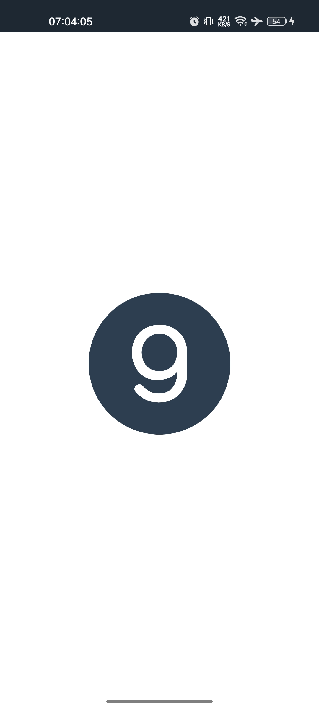
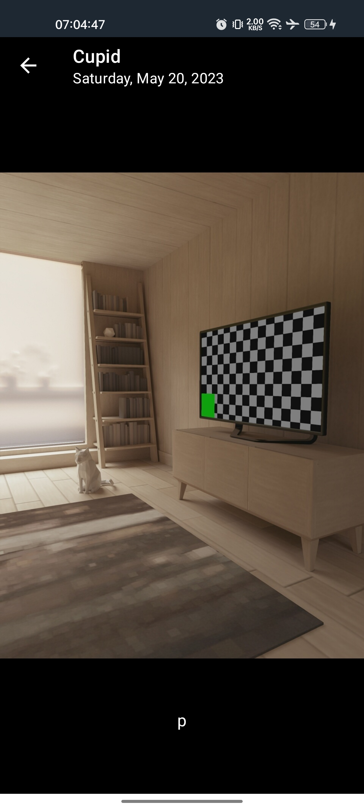
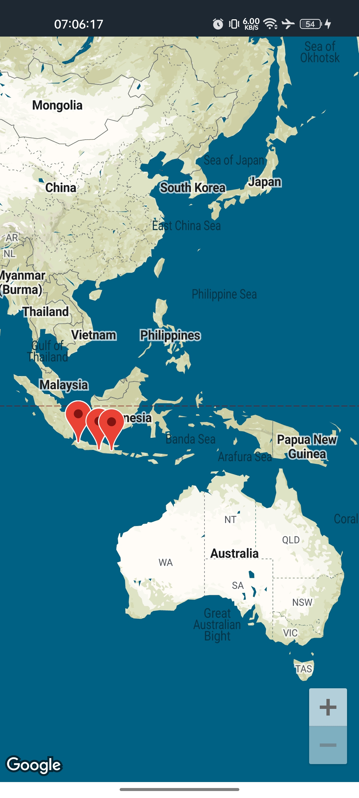

# StoryDicoding
The First & Final Submission on Belajar Pengembangan Aplikasi Android Intermediate (BPAAI) class Dicoding Academy in Bangkit Academy Mobile Development 2023

> [!WARNING]
> USE THIS PROJECT AS A REFERENCE FOR YOUR SUBMISSION. DO NOT SEND OR COPY PASTE THIS PROJECT FOR YOUR SUBMISSION!

## The Final Submission Screenshots :
<table>
    <tr>
        <td>
        <td>
        <td>
        <td>
    </tr>
    <tr>
        <td>
        <td>
         <td>
        <td>
   </tr>
<table>
